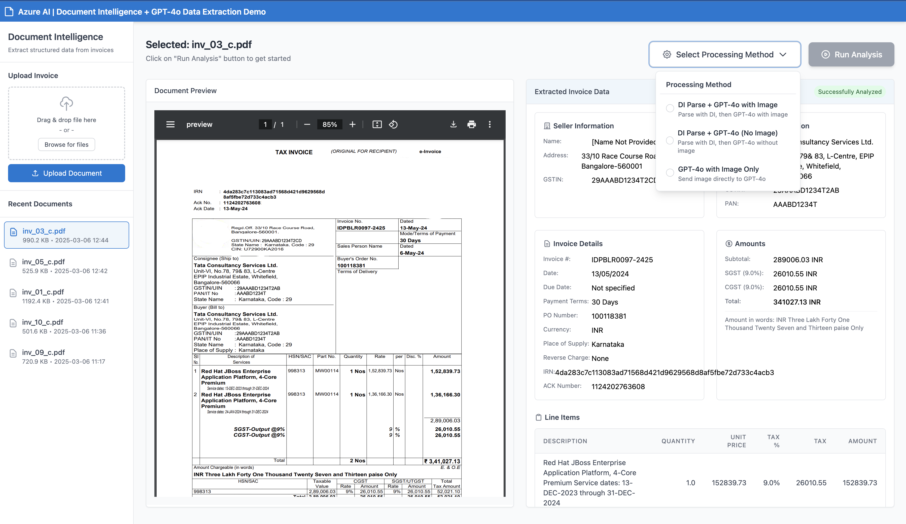

# AWS-Powered Invoice Processing Application

## Overview
This application leverages Amazon Web Services (AWS) and other AI services to automatically extract structured data from invoices. It combines Amazon Textract for optical character recognition (OCR) with Claude AI for advanced data extraction, providing a web-based interface for uploading invoices and viewing the extracted information in a standardized format.

## Features
- Upload PDF invoices for processing
- Multiple processing methods with AWS focus:
  - **Textract + Claude**: Our primary method combines Amazon Textract's OCR capabilities with Claude 3.5 Sonnet for multimodal processing and structured information extraction
  - **Bedrock Claude Sonnet**: Direct integration with Amazon Bedrock's Claude Sonnet model
  - **Bedrock Data Automation**: Utilizes Amazon Bedrock's Data Automation capabilities
  - Additional processing methods also available as alternatives (GPT-4o and Document Intelligence)
- Interactive UI with real-time feedback
- Display of extracted invoice data in a structured format
- Intelligent post-processing with AWS-based algorithms

## Setup and Installation

### Local Setup

### Prerequisites
- Python 3.8 or higher
- AWS account with access to Amazon Textract and Amazon Bedrock (for Claude 3.5 Sonnet)
- Proper IAM permissions for AWS services
- Optional: Access to other document intelligence and AI services for alternative processing methods

### Installation Steps
1. Clone the repository
2. Install required dependencies:
   ```
   pip install -r requirements.txt
   ```
3. Configure your environment variables:
   
   a. Copy the provided `.env.sample` file to create your own `.env` file:
   ```
   cp .env.sample .env
   ```
   
   b. Open the `.env` file in a text editor and replace the empty quotes with your actual API keys and endpoints:
   ```
   # AWS Settings (Primary)
   AWS_REGION="us-east-1"
   AWS_ACCESS_KEY_ID="your-aws-access-key"
   AWS_SECRET_ACCESS_KEY="your-aws-secret-key"
   BEDROCK_CLAUDE_MODEL_ID="arn:aws:bedrock:us-east-1:302263040839:inference-profile/us.anthropic.claude-3-5-sonnet-20240620-v1:0"
   
   # Alternative Processing Methods Settings (Optional)
   DOC_INTELLIGENCE_ENDPOINT="your-doc-intelligence-endpoint"
   DOC_INTELLIGENCE_KEY="your-doc-intelligence-key"
   OPENAI_API_KEY="your-openai-key"
   OPENAI_MODEL="gpt-4o"
   ```

### AWS Deployment

This application can be deployed to AWS using multiple approaches. Here are two recommended methods:

#### Option 1: AWS Elastic Container Service (ECS)

1. **Prerequisites**:
   - Docker installed and running
   - AWS CLI configured with appropriate permissions
   - Amazon ECR repository created

2. **Deployment Steps**:
   
   a. Build and tag the Docker image:
   ```
   docker build -t invoice-parsing-app:latest .
   ```
   
   b. Log in to Amazon ECR:
   ```
   aws ecr get-login-password --region us-east-1 | docker login --username AWS --password-stdin your-aws-account.dkr.ecr.us-east-1.amazonaws.com
   ```
   
   c. Tag and push the Docker image to ECR:
   ```
   docker tag invoice-parsing-app:latest your-aws-account.dkr.ecr.us-east-1.amazonaws.com/invoice-parsing-app:latest
   docker push your-aws-account.dkr.ecr.us-east-1.amazonaws.com/invoice-parsing-app:latest
   ```
   
   d. Create an ECS cluster, task definition, and service using the AWS console or CLI
   
   e. Configure environment variables in the task definition

#### Option 2: AWS Elastic Beanstalk

1. **Prerequisites**:
   - AWS CLI and EB CLI installed
   - Proper IAM permissions

2. **Deployment Steps**:
   
   a. Initialize Elastic Beanstalk application:
   ```
   eb init -p docker invoice-parsing-app
   ```
   
   b. Create an environment and deploy:
   ```
   eb create invoice-parsing-environment
   ```
   
   c. Configure environment variables:
   ```
   eb setenv AWS_REGION=us-east-1 AWS_ACCESS_KEY_ID=your-key BEDROCK_CLAUDE_MODEL_ID=arn:aws:bedrock:us-east-1:302263040839:inference-profile/us.anthropic.claude-3-5-sonnet-20240620-v1:0
   ```

### Required Files
The following files are necessary for running the application:

1. **app.py** - The main Flask application file that contains the server logic
2. **.env** - Environment variables file containing your API keys and endpoints
3. **.env.sample** - Template file with the structure for your .env file
4. **templates/index.html** - The HTML template for the web interface
5. **requirements.txt** - Lists all Python dependencies
6. **static/** - Directory for CSS, JavaScript, and static assets including screenshots
7. **uploads/** - Directory where uploaded invoices are stored

### Running the Application
Run the application using:
```
python app.py
```
The application will be accessible at http://localhost:5000 in your web browser.

## Usage
1. Open the application in your browser
2. Upload an invoice PDF using the "Upload Document" button
3. Select a processing method from the dropdown:
   - **AWS-Powered Methods**:
     - **Textract + Claude**: Combines Amazon Textract OCR with Claude's multimodal processing (recommended)
     - **Bedrock Claude Sonnet**: Direct integration with Amazon Bedrock's Claude model
     - **Bedrock Data Automation**: Utilizes Amazon Bedrock's automation capabilities
   - **Alternative Methods**:
     - **DI + GPT-4o with Image**: Document Intelligence with GPT-4o vision capabilities
     - **DI + GPT-4o (No Image)**: Document Intelligence with GPT-4o text-only processing
     - **GPT-4o with Image Only**: Direct processing with GPT-4o vision capabilities
     - **DI + Phi-3**: Document Intelligence with Microsoft Phi-3 language model
4. Click "Run Analysis" to process the invoice
5. View the extracted information displayed on the page

## Notes
- The application stores uploaded files in the `uploads` directory
- Processed results are cached to improve performance
- AWS credentials are securely handled
- Amazon Textract extracts text from invoices while Claude 3.5 Sonnet extracts structured information
- The application includes post-processing logic to ensure critical fields like seller information and tax calculations are complete

## Screenshots

### Main Application Interface


### Processing Method Selection Dropdown


## Troubleshooting
- If you encounter environment variable errors, ensure your `.env` file contains all required variables
- For PDF rendering issues, ensure you have the necessary system dependencies for pdf2image
- Check application logs for detailed error information
